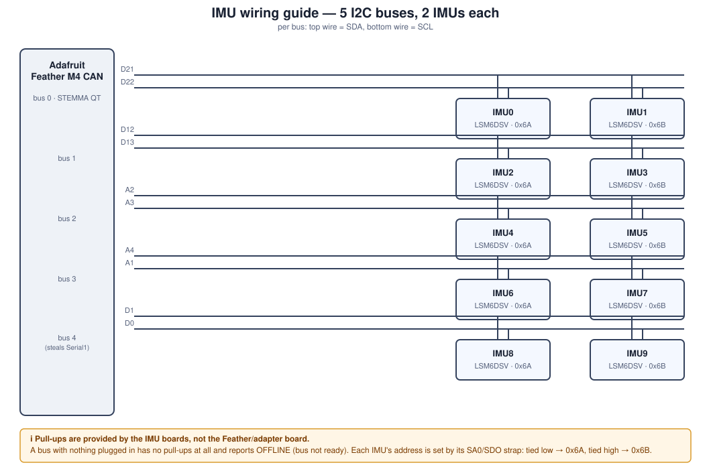
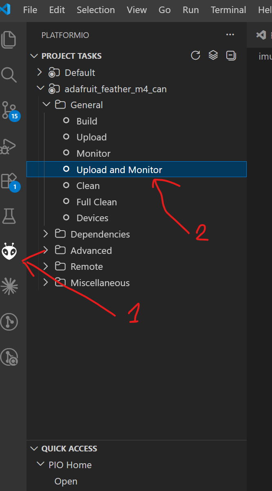

# IMU Reader — Feather M4 CAN

Firmware for an Adafruit Feather M4 CAN Express that reads up to 10 ST
LSM6DSV IMUs over five parallel I2C buses, sends accelerometer, gyroscope,
and orientation (quaternion) data out over CAN, reports per-sensor
connection health over USB Serial, and shows an at-a-glance health summary
on the board's onboard NeoPixel.

This board sits on a custom adapter/carrier PCB (see the sibling
`adapter_board` repo) that breaks out 10 AYF530435 FPC connectors, two per
I2C bus, for the IMU sensor boards.

## Contents

- [Hardware overview](#hardware-overview)
- [I2C bus topology](#i2c-bus-topology)
- [Status LED](#status-led)
- [Serial output](#serial-output)
- [CAN output](#can-output)
- [Setting up PlatformIO (VS Code)](#setting-up-platformio-vs-code)
- [Building, flashing, monitoring](#building-flashing-monitoring)
- [Configuration](#configuration)
- [How detection & reconnect work](#how-detection--reconnect-work)
- [Known quirks / gotchas](#known-quirks--gotchas)
- [Repo layout](#repo-layout)
- [License](#license)

## Hardware overview

- **MCU board**: Adafruit Feather M4 CAN Express (SAME51J19A, Cortex-M4,
  120 MHz), with an onboard CAN transceiver. Datasheet/pinout:
  `docs/Adafruit Feather M4 Express CAN Pinout.pdf`.
- **Sensors**: up to 10x ST **LSM6DSV** 6-axis IMU (accel + gyro), which also
  has an onboard sensor-fusion engine (SFLP) that computes an orientation
  quaternion in hardware. Datasheet: `docs/lsm6dsv.pdf`. Driver: ST's own
  register-level driver, vendored in `src/lsm6dsv_reg.c` /
  `include/lsm6dsv_reg.h` (do not hand-edit — it's the ST source,
  regenerate/replace wholesale if it ever needs updating).
- **Status indicator**: the Feather's onboard NeoPixel (single WS2812-style
  RGB LED, `PIN_NEOPIXEL` on the board).
- Each IMU's I2C address is set in hardware by strapping its SA0/SDO pin:
  tied low → `0x6A`, tied high → `0x6B`. Two IMUs (one at each address)
  share each physical I2C bus.

## I2C bus topology

The M4's default `Wire` only gives you one I2C bus. To talk to 10 IMUs at
once, this firmware repurposes four additional SERCOM peripherals as extra
`TwoWire` instances, so there are **5 physical I2C buses, 2 IMUs each**:

| Bus | `TwoWire` object | SDA pin | SCL pin | SERCOM | IMU slots |
|-----|------------------|---------|---------|--------|-----------|
| 0 | `Wire` (onboard STEMMA QT) | D21 | D22 | SERCOM2 | IMU0 (0x6A), IMU1 (0x6B) |
| 1 | `busWire1` | D12 | D13 | SERCOM3 | IMU2 (0x6A), IMU3 (0x6B) |
| 2 | `busWire2` | A2 | A3 | SERCOM4 | IMU4 (0x6A), IMU5 (0x6B) |
| 3 | `busWire3` | A4 | A1 | SERCOM0 | IMU6 (0x6A), IMU7 (0x6B) |
| 4 | `busWire4` | D1 | D0 | SERCOM5 | IMU8 (0x6A), IMU9 (0x6B) |

Notes:
- Bus 4 repurposes `D0`/`D1`, which are normally `Serial1`'s RX/TX pins —
  don't expect `Serial1` to work while this firmware runs.
- **None of the buses have pull-ups on the Feather/adapter board itself.**
  Pull-ups are provided by the IMU sensor boards, not something to add
  separately — a bus with an IMU plugged in gets pull-ups from that board.
  A bus with nothing plugged in has no pull-ups at all and never reaches a
  valid idle-high state, which is why every IMU on it reports
  `OFFLINE (bus not ready -- check wiring/pull-ups)` — that's this specific
  failure mode, not a generic "not detected".
- Bus/pin assignments live in `buses[]` in `src/imu.cpp`; which IMU index
  maps to which bus/address lives in `SENSOR_BUS[]` / `SENSOR_ADDR[]` right
  below it.

Same information as a wiring diagram:



## Status LED

The onboard NeoPixel gives a health summary with no terminal required:

| Phase | Color | Meaning |
|-------|-------|---------|
| Boot / detecting | **Blue** (solid) | Probing all 10 IMU slots at startup. |
| Just after boot | **White** (flashing) | Flashes once per IMU that was found at boot — count the flashes to know how many connected. |
| Running | **Green** | All IMUs that were found at boot are currently online and have never dropped. |
| Running | **Orange** | Everything is currently online, but at least one IMU has disconnected and reconnected at some point since boot. |
| Running | **Red** | At least one IMU that was found at boot is currently offline right now. Takes priority over orange. |

Once an IMU has disconnected at least once, the LED will never go back to
green for the rest of the run (it settles to orange instead) — this is
intentional, it's a "has this run been perfectly clean" indicator, not just
"is everything currently fine".

## Serial output

Open a serial monitor at **115200 baud**. At boot you get a CAN status
line, then one line per IMU slot, in order:

```
CAN: started
IMU0: initialized
IMU1: initialized
IMU2: OFFLINE (bus not ready -- check wiring/pull-ups)
...
```

After that, once per second (`STATUS_PRINT_INTERVAL_MS`), a single
fixed-width status line is printed for every IMU that *did* respond at
boot (others are permanently omitted — see below), or `no IMU detected` if
none did:

```
IMU0  ONLINE  drops=  0 z= -444.6mg | IMU1  ONLINE  drops=  0 z=  204.5mg
```

`drops` counts how many times that IMU has gone from online to offline
since boot. `z` is the most recent accelerometer Z-axis reading in mg (not
printed live per-sample — only this cached table).

Between status lines, transition events are still printed immediately as
they happen, e.g. `IMU0: OFFLINE (lost communication)` or `IMU0: back
online`.

## CAN output

Each online IMU's accelerometer, gyroscope, and orientation data is sent
out over the Feather's onboard CAN transceiver as it becomes available —
there's no batching/timer, a frame goes out the moment new data is read.

- **Library**: [Adafruit CAN](https://github.com/adafruit/Adafruit_CAN)
  (`CANSAME5x` class), which wraps the SAME51's built-in CAN0 peripheral.
- **Bitrate**: 1 Mbps (`CAN_BITRATE` in `src/can_bus.cpp`).
- **Frame size**: classic CAN, 8 bytes max (no CAN FD).

Every frame has the same shape — 3 values (2 bytes each, little-endian) + a
1-byte sequence counter + 1 reserved byte:

| Bytes | Field |
|-------|-------|
| 0-1 | value 0 |
| 2-3 | value 1 |
| 4-5 | value 2 |
| 6 | sequence counter (wraps 0-255, one counter per IMU per data type — lets a receiver detect dropped frames) |
| 7 | reserved (`0x00`) |

| Data | CAN IDs | Values | Encoding |
|------|---------|--------|----------|
| Accelerometer | `0x100`-`0x109` (IMU `i` → `0x100+i`) | X, Y, Z acceleration | `int16`, 1 mg/LSB |
| Gyroscope | `0x110`-`0x119` (IMU `i` → `0x110+i`) | X, Y, Z angular rate | `int16`, 0.1 dps/LSB |
| Quaternion | `0x120`-`0x129` (IMU `i` → `0x120+i`) | qx, qy, qz | raw IEEE-754 half-precision float bits, passed through unmodified |

**Quaternion note**: the LSM6DSV computes orientation in hardware via its
SFLP ("Sensor Fusion Low Power") **Game Rotation Vector** engine, delivered
through the sensor's FIFO rather than a simple data-ready register like
accel/gyro (see `initImu()`'s SFLP setup and the FIFO-drain loop in
`imuSystemPoll()`, both in `src/imu.cpp`). The sensor only ever outputs 3 of
the 4 quaternion components (qx, qy, qz) as half-precision floats — **qw is
never transmitted**. Since it's a unit quaternion, a receiver that needs the
full 4-component form reconstructs it itself:
`qw = sqrt(max(0, 1 - qx² - qy² - qz²))`. The firmware does zero conversion
for this frame — it copies the FIFO record's raw bytes straight into the CAN
payload.

**Verifying CAN output without a CAN-to-USB adapter**: flip
`CAN_LOOPBACK_VERIFY_ENABLED` to `true` in `src/can_bus.cpp` and reflash.
This puts the SAME51's CAN0 peripheral into loopback mode, which routes
every frame it transmits back into its own receiver (it still also drives
the physical bus/TX pin, so an external analyzer would see the same
traffic) and prints each one to Serial as `CAN rx id=0x... data=...` — a
full round-trip check of the whole send path with nothing but the board
itself. Flip it back to `false` for normal operation.

## Setting up PlatformIO (VS Code)

This project uses [PlatformIO](https://platformio.org/), not the Arduino
IDE. If you don't have it yet:

1. Install [Visual Studio Code](https://code.visualstudio.com/).
2. Open VS Code, go to the Extensions view (`Ctrl+Shift+X`), search for
   **"PlatformIO IDE"** (publisher: PlatformIO), and click **Install**.
   - This pulls in its own Python environment and toolchains automatically
     — you don't need to install Python, GCC, or any Arduino cores by
     hand. First-time setup can take a few minutes.
   - VS Code will prompt you to reload after installation; do that.
3. A new alien-head **PlatformIO icon** appears in the VS Code activity bar
   (left-hand sidebar) once installed.
4. In VS Code: **File → Open Folder…** and select this `imu_reader`
   folder (the one containing `platformio.ini`). PlatformIO auto-detects
   the project from `platformio.ini` — no manual project setup needed.
5. The first time you open the project, PlatformIO downloads the
   `atmelsam` platform, the Arduino framework core for SAMD/Adafruit
   boards, and the libraries listed under `lib_deps` in `platformio.ini`
   (`Adafruit NeoPixel` and `Adafruit CAN`). Watch the PlatformIO output
   panel at the bottom for progress.

You don't need the separate Arduino IDE or `arduino-cli` installed — the
PlatformIO extension is self-contained.

## Building, flashing, monitoring

All of this is available both as PlatformIO's own VS Code toolbar buttons
(bottom status bar: checkmark = build, arrow = upload, plug icon =
monitor) and as CLI commands (`pio`, available in any terminal once the
PlatformIO IDE extension has installed its CLI, or via VS Code's
integrated terminal).

The same tasks are also reachable from the PlatformIO sidebar: click the
alien-head icon in the activity bar (**1**), then run a task like
**Upload and Monitor** under *adafruit_feather_m4_can → General* (**2**) —
this one builds, flashes, and immediately opens the serial monitor in one
step:



Or via the CLI:

```sh
pio run                 # build
pio run -t upload       # build + flash over USB
pio device monitor      # open a serial monitor (115200 baud, matches platformio.ini)
```

Plug the Feather M4 CAN in via USB before uploading. Uploading uses the
board's native USB bootloader (`sam-ba` protocol, 1200bps-touch reset) — no
physical reset button press should be needed.

**If upload fails with "No device found on COM_"**: this SAM-BA upload
sequence is known to be flaky — it fails once or twice before succeeding
on a bare retry more often than not. Just run `pio run -t upload` again.
If it persists, check nothing else (another serial monitor, another
PlatformIO instance) is holding the COM port open, and check the board is
actually enumerated (`pio device list`).

## Configuration

A handful of `#define`s control behavior — change and reflash, there's no
runtime config:

| Define | Default | Where | Effect |
|--------|---------|-------|--------|
| `I2C_CLOCK_HZ` | `400000` | `src/imu.cpp` | I2C bus clock speed (Hz) for every bus. LSM6DSV supports up to `1000000` (Fast-mode+); `400000` is Fast-mode. Standard-mode is `100000`. |
| `OFFLINE_RETRY_INTERVAL_MS` | `2000` | `src/imu.cpp` | How often an eligible-but-currently-offline IMU is re-probed. |
| `STATUS_PRINT_INTERVAL_MS` | `1000` | `src/imu.cpp` | How often the combined status line is printed. |
| `AUTO_RECONNECT_ENABLED` | `true` | `src/imu.cpp` | Set to `false` to disable all reconnect attempts — an IMU that drops just stays `OFFLINE` until you flip this back and reflash. |
| `CAN_BITRATE` | `1000000` | `src/can_bus.cpp` | CAN bus bitrate in bps. |
| `CAN_LOOPBACK_VERIFY_ENABLED` | `false` | `src/can_bus.cpp` | See [CAN output](#can-output) — set `true` to self-verify CAN sending without external hardware. |

## How detection & reconnect work

- At boot, **every** IMU slot (0-9) is probed exactly once, in order,
  regardless of whether its bus has ever been used before.
- **Only IMUs that responded at boot are ever retried again.** A slot
  that fails at boot (`eligibleForRetry = false`) is permanently excluded
  from the retry loop, the status table, and further I2C traffic for the
  rest of the run — even if you plug something into it later, it will not
  be picked up without a reset/reflash. This is deliberate: it keeps the
  ongoing status view focused on the sensors that are actually wired up,
  rather than retrying 10 slots forever when you might only have 2
  connected.
- IMUs that *did* respond at boot keep auto-reconnecting on the
  `OFFLINE_RETRY_INTERVAL_MS` timer if they drop later (unless
  `AUTO_RECONNECT_ENABLED` is `false`).
- **If you wire up a new sensor and want it picked up, reset or reflash
  the board** so the boot probe runs again.

## Known quirks / gotchas

- **No `%f` in `printf`/`snprintf` on this toolchain.** This Arduino core's
  libc has no floating-point printf support by default — `%f`/`%7.1f`
  silently produces an empty string, not a compile or runtime error. Use
  `dtostrf()` (declared via `#include <avr/dtostrf.h>`) to format floats
  instead, as `printStatusTable()` in `src/imu.cpp` does.
- **A floating (unconnected) bus can occasionally read as idle and hang
  boot.** `claimBusIfIdle()` samples SDA/SCL once to decide whether a bus
  is safe to claim (see the previous gotcha for why). A plain `INPUT` on a
  genuinely unconnected pin floats, and a floating read is undefined —
  ambient noise can make it read HIGH by chance, letting a bus with
  nothing attached get claimed and then hang forever on its first real
  I2C transaction (no external hardware present to ACK/NACK it). This is
  why the check uses `INPUT_PULLDOWN` instead of plain `INPUT`: it makes
  an unconnected pin read a deterministic LOW, while a real external
  pull-up (a few kOhm) still easily overpowers the weak internal
  pull-down (tens of kOhm) on a properly wired bus. If you ever see boot
  seem to hang and touching/grounding an unconnected sensor's SDA pin
  unblocks it, that's this — it means a bus lacks pull-ups entirely (not
  just "no sensor attached").
- **Don't toggle `pinMode()` on a bus's SDA/SCL pins after it's been
  claimed.** Once a bus's `wire->begin()` has been called
  (`claimBusIfIdle()` in `src/imu.cpp`), doing a `pinMode(INPUT)` →
  `pinPeripheral(restore)` round-trip on those pins breaks I2C
  communication on that bus, even on otherwise-healthy hardware. This was
  the root cause of an earlier "no connection" bug and is why the idle
  check only ever runs once, before a bus's first claim.
- **`Adafruit TinyUSB Library` is deliberately excluded** via `lib_ignore`
  in `platformio.ini`. `Adafruit_NeoPixel.h` has a guarded `#include
  <Adafruit_TinyUSB.h>` for boards that use the TinyUSB stack; PlatformIO's
  Library Dependency Finder scans `#include` lines as plain text and pulls
  that library in regardless of the surrounding (never-taken) `#ifdef`,
  and it fails to build without a USB stack explicitly selected. If you
  add a library later and see it suddenly fail to build with `Adafruit
  TinyUSB` compile errors, this is why.
- **Bus 4 steals `Serial1`'s pins** (D0/D1) — see the topology table above.
- **A misbehaving IMU can get stuck and stay stuck across MCU resets.**
  While bringing up the SFLP/quaternion feature, one IMU ended up in a
  state where it stopped responding to *any* I2C transaction, including a
  basic `WHO_AM_I` read — reflashing or resetting the Feather didn't help,
  since that only resets the MCU, not the sensor chip. Power-cycling the
  IMU (removing its power entirely, not just the Feather's USB) cleared
  it. If an IMU that previously worked suddenly won't respond to anything
  and reflashing doesn't help, try power-cycling that sensor before
  assuming it's a wiring or firmware problem.

## Repo layout

```
src/main.cpp             setup()/loop() orchestration only -- calls into the modules below
src/can_bus.h/.cpp        CAN0 setup, frame encoding/sending, loopback self-verification
src/imu.h/.cpp            I2C bus management, IMU detection/reconnect, accel/gyro/quaternion reads, Serial status table
src/status_led.h/.cpp     NeoPixel status indicator
src/lsm6dsv_reg.c         vendored ST LSM6DSV register driver (do not hand-edit)
include/lsm6dsv_reg.h     ^ its header
docs/lsm6dsv.pdf                                 LSM6DSV datasheet
docs/Adafruit Feather M4 Express CAN Pinout.pdf   Feather M4 CAN pinout reference
platformio.ini            board/framework/library config
```

## License

This project is licensed under the [MIT License](LICENSE).

The vendored ST driver (`src/lsm6dsv_reg.c`, `include/lsm6dsv_reg.h`) is
Copyright (c) STMicroelectronics and remains under ST's own license terms
(see the header comment in those files) — it is not covered by this
project's MIT license.
